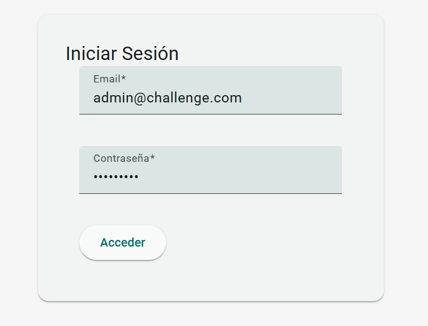

# README

Este README describe el proyecto, asi como la puesta en marcha de la aplicación.

# Repositorio de evaluación

Este repositorio fue hecho con la finalidad de ayudar en el proceso de evaluación para la vacante de desarrollador Full Stack Developer.

### Diseño y arquitectura.

Para este proyecto se baso en los requerimientos de la evaluación, tomando en cuenta la arquitectura en 3 capaz:
- Repository (para la lógica de base de datos)
- Services (para la lógica de negocio)
- Controlador (para manejar las peticiones HTTP)

Esta arquitectura nos permite la separacion en niveles, por lo cual cada nivel se ejecuta en su propia infraestructura, pudiendo escalar o actualizar según sea necesario.

Tambien basta destacar que el proyecto esta desarrollado en base a los siguientes patterns:
- Repository: Se aplicó dicho pattern para poder tener un código separado y mantenible entre las capas de acceso a datos y la lógica de negocios de la aplicación.
- Layered Architecture (Arquitectura en capas): Donde cada capa tiene una responsabilidad específica.
- DTO (Patrón Data Transfer Object): Se utiliza objetos simples para transferir datos cliente-servidos.
- Middleware.
- Inyección de Dependencias.

En cuestión de la data se aplicó el enfoque Code First, en la cual la base de datos se estructura en base al siguiente diagrama de ER:


## Backend

### Principales Librerias y Framewoks Usados.

**Python**: Mandatorio para el desarrollo de la API para este proyecto.

**Falcon Framework**: Decidí usar Falcon porque es un microframework diseñado para crear microservicios muy rápidos. Es muy flexible, ya que permite instalar complementos y otras bibliotecas (p. ej., Jinja2, SQLAlchemy, etc.) fácilmente. Fomenta el estilo arquitectónico REST e intenta minimizar el uso de recursos, manteniendo una alta eficiencia. Su documentación no es muy extensa y es muy comprensible.
Una buena explicación:

[**https://eshlox.net/2017/08/27/do-you-want-to-use-django-for-rest-api-consider-it**](https://eshlox.net/2017/08/27/do-you-want-to-use-django-for-rest-api-consider-it)

**PostgreSQL**: Lo incluimos como base de datos para desarrollo de las API´s, PostgreSQL nos permite consultar datos con una reputación de su velocidad, fiabilidad, compatibilidad, por lo que se adapta al desarrollo backend para este proyecto en particular.

**Marshmallow**: Para realizar validaciones y la serialización de objetos, tiene buena documentación. [is an ORM/ODM/framework-agnostic library for converting complex datatypes, such as objects, to and from native Python datatypes.]

**SQLAlchemy**: Por el tiempo corto, un ORM puede ayudar para la comunicación con la bd. [SQLAlchemy is the Python SQL toolkit and Object Relational Mapper that gives application developers the full power and flexibility of SQL.

It provides a full suite of well known enterprise-level persistence patterns, designed for efficient and high-performing database access, adapted into a simple and Pythonic domain language.]

**Pygogo**: Para logging, para realizar los logs. [pygogo is a Python logging library and command-line interface with super powers. pygogo leverages the standard Python logging module under the hood, so there's no need to learn yet-another logging library. The default implementation sends all messages to stdout, and any messages at level WARNING or above also to stderr]


**PyJWT**: Para la creación de tokens JWT y cumple con los standares y es de las mas utilizadas, por lo que cuenta con mucha documentación . [is a Python library which allows you to encode and decode JSON Web Tokens (JWT). JWT is an open, industry-standard (RFC 7519) for representing claims securely between two parties.]

**PyTest**: Para las pruebas unitarias, existe mucha documentación y es mas sencilla que la que viene con python (unittest). [The pytest framework makes it easy to write small tests, yet scales to support complex functional testing for applications and libraries.]


### Instalación

Ver archivo install-backend.pdf [Click Aquí](https://github.com/kevbrygil/clients-app/blob/main/install-backend.pdf)

### Documentación

Ver archivo api-docs.pdf [Click Aquí](https://github.com/kevbrygil/clients-app/blob/main/api-docs.pdf)

### POSTMAN
[Documentacion](https://documenter.getpostman.com/view/268102/2sB3BDLXRP)

Ver archivo Falcon.postman_collection.json

### TODO

- TESTS Unitarios
- Actualiza, Eliminar y Búsqueda por ID (Customer, User, Role)


## Frontend

**Angular 20**: Por requerimientos de la evaluación, el proyecto Frontend esta desarrollado en base al framework de Angular. Angular 20, trae varias mejoras significativas. Entre las más destacadas se encuentran la eliminación de Zone.js para la detección de cambios, reemplazándola por un sistema de reactividad basado en señales.

**Material**: Nos ofrece un repositorio repleto de componentes, que por consiguiente nos permite diseñar componentes web personalizados. Por estas ventajas descritas es que se incluyó en el proyecto.

**Typescript**: Nos brinda a nuestro proyecto un mejor orden en cuestion de tipado y detectar rapidamente errores en nuestro editor.

**ESLint**: Es una herramienta de programación, que nos permite detectar código confuso ó incompatible entre distintas arquitecturas. Más explicitamente nos permite detectar errores de programación que solemos producir.

**Prettier**: Lo que ofrece esta herramienta es tomar nuestro codigo y re-formatearlo en base a las configuraciones definitas en el archivo .prettierrc.js

### Requisitos para frontend

**Nodejs**: Se probó con la versión 22.16.0, sino cuenta con alguno, se sugiere usar NVM para usar multiples versiones.

**NPM**: Se probó con la versión 10.9.2

### Deploy Frontend
Podemos compilar con el siguiente script(debe tener en cuenta la configuracion de la ruta de la api en los environments files):

```
npm run build
```

De ahi podemos configurar nuestro servidor con el servicio de Nginx, parecido a esta configuracion:

```
server {
    listen 80;
    server_name challenge.com www.challenge.com;

    # Define the root directory for your static files
    root /var/www/mysitechallenge/static;

    location / {
        try_files $uri $uri/ =404;
    }

    access_log /var/log/nginx/challenge.com.access.log;
    error_log /var/log/nginx/challenge.com.error.log;

}
```

### Deploy Recomendado en ambos (back y front)

Se puede usar AWS o Azure con la integración continua (CI/CD) en base a los pipelines, por lo que nos garantiza la acelaración del desarrollo y tener el codigo siempre disponible en nuestros entornos.

### Instalación

1.- Clone el repositorio

```
git clone https://github.com/kevbrygil/clients-app.git
```

2.- Dentro de la carpeta del repositorio, dirijase a la carpeta frontend e instale las librerias necesarias para la aplicacion web.

```
cd frontend
npm install
```

3.- Si tiene una ruta diferente al puerto del api propuesto en el backend, dirijase al archivo frontend/src/environments/environment.ts y agregue la ruta de la API de la aplicación (la variable debe llamarse apiUrl)

```
export const environment = {
  production: false,
  apiUrl: 'http://localhost:5000/v1'
};
```

4.- Ejecute la web app en la consola

```
cd frontend
ng serve -o
```
ó tambien:

```
cd frontend
npm run start
```

5.- Acceder al sitio localmente

```
http://localhost:4200/  #Puede variar segun los puertos disponibles
```

### Explicación de la interfaz

#### Iniciar sesión o registrarse

Se realizar una autentificacion en base a JWT, para obtener un inicio de sesión y navegación de manera segura.




#### Pantalla inicio

Desde aqui puedes ver la lista de todos los clientes registrados en el sistema. Asi como agregar nuevos clientes, modificar o eliminar.
Existen roles de usuario admin y viewer(descritos en el documento pdf del backend). El backend si se corre en docker(vea el manual de instalación del backend) nos crea dos usuarios para autentificarse:

Email: admin@challenge.com
Password: "123456789"

Email: viewer@challenge.com
Password: "123456789"

Cabe mencionar que para la consulta y creación del cliente lo pueden realizar todos los usuarios(Viewer y admin) pero para editar o eliminarlos solo esta permitido el usuario admin.


#### Pantalla Crear Cliente


#### Pantalla Editar Cliente


#### Eliminar Cliente


